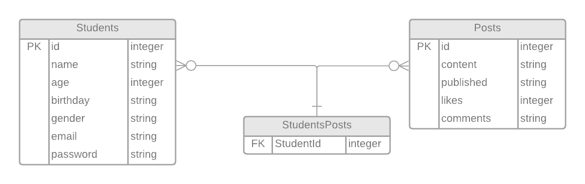

# Projeto Tryitter :bird:

 Inserir um banner legal ou somente retirar essa div

<h2>Índice</h2>

 :round_pushpin: [Sobre](#sobre) 
 :round_pushpin: [Tecnologias](#tecnologias) 
 :round_pushpin: [Usabilidade](#usabilidade) 
 :round_pushpin: [Documentação](#documentacao) 
 :round_pushpin: [Orientações](#orientacoes) 
 :round_pushpin: [Scripts](#scripts) 
 :round_pushpin: [Testes](#testes) 
 :round_pushpin: [DER](#der) 
 :round_pushpin: [Referências](#referencias) 

<h2 id="sobre">Sobre</h2>

Esta aplicação tem como objetivo gerenciar uma rede social  :iphone:

 - Esta é uma aplicação em `.NET` com `Entity Framework` fazer um CRUD de contas e posts. Infelizmente não foi possível realizar o deploy na `Azure`, consulte a seção [documentação](#documentacao) para entender melhor.
 - Esta aplicação seguiu os princípios do REST e se conecta ao banco de dados `MySQL Server`.
 - Para acessar a API, é necessário que a pessoa usuária faça login com suas credencias e isso será autenticado e autorizado via JWT com a geração de token.
 - É possível também que a pessoa usuária possa se cadastrar e utilizar a API, a partir disso é gerado um token para acesso a API.

<h2 id="tecnologias">Tecnologias</h2>

  
  
  
  
  

 <h2 id="usabilidade">Usabilidade</h2>

> Veja a seção de [documentação](#documentacao) para entender melhor como funcionam as rotas.
> Veja a seção de [orientações](#orientacoes) antes de rodar a aplicação.

:round_pushpin: Acessando o local pelo Swagger:

> Faça um clone deste repositório:
- `git@github.com:brenndha-cabral/tryitter.git` 

> Após rodar a aplicação localmente ou pelo docker, você deverá acessar através de:
- `https://localhost:7136/swagger/index.html` 

> Caso prefira outro cliente, aqui estão algumas sugestões:
  :bulb: [HTTPie](https://httpie.io/) | :bulb: [Postman](https://www.postman.com/) | :bulb: [Insomnia](https://insomnia.rest/) | :bulb: [Thunder Client](https://marketplace.visualstudio.com/items?itemName=rangav.vscode-thunder-client)

<h2 id="documentacao">Documentação</h2>

> :information_source: É necessário rodar a aplicação localmente para que abra o Swagger com os endpoints e orientações.

> Caso não tenha conhecimento em Swagger, clique [aqui](https://www.youtube.com/watch?v=cOhguRdlr5A) e veja como é fácil utilizar.

 - Motivo por não ter realizado o deploy: Criei a conta na Azure mas infelizmente não sou elegível para testar gratuitamente. Informei à Trybe o ocorrido.

<h2 id="orientacoes">Orientações</h2>

<strong>:whale2: Rodando com Docker</strong>

### 👉 Com Docker

> :information_source: Rode os serviços `asp` e `db` com o comando `docker-compose up`.
- Esse comando irá inicializar os containers chamados `tryitter` e `sql_server_dbb`;

- A partir daqui você pode acessar o container `tryitter` via CLI ou abri-lo no seu editor;

> :information_source: Use o comando `docker exec -it tryitter sh`.
- Ele te dará acesso ao terminal interativo do container criado pelo docker-compose.

> :information_source: Ao rodar o docker-compose, ele criará uma imagem do banco de dados `MySQL Server`. 

<h2 id="scripts">Scripts</h2>

<strong>:pencil: Aqui estão os scripts da aplicação para que você possa utilizar</strong>
 

- `dotnet restore`: Irá instalar os pacotes NuGets;

- `dotnet ef database update`: Irá criar o banco de dados localmente;

- `dotnet run`: Irá rodar a aplicação;

- `dotnet test`: Irá rodar todos os testes de integração da aplicação;

> Sinta-se à vontade para ajustar os scripts de acordo com a sua necessidade.

<h2 id="testes">Testes</h2>

<strong>🧪 Foram realizados testes de integração para atingir a cobertura mínima de 30%</strong>
 

> Foram realizados testes de unidade e de integração com `xUnit` e `Fluent Assertions`.

    

<h2 id="der">Diagrama Entidade Relacionamento</h2>

<strong>:chart_with_upwards_trend: Clients | Assets | Orders | AccountOperations</strong>
 

  

    
  

<h2 id="referencias">Referências</h2>

> :information_source: Este projeto foi a realização de um projeto final da aceleração de C# da [Trybe](https://www.betrybe.com/) em parceria com a [XP Inc.](https://www.linkedin.com/company/xp-inc/)
